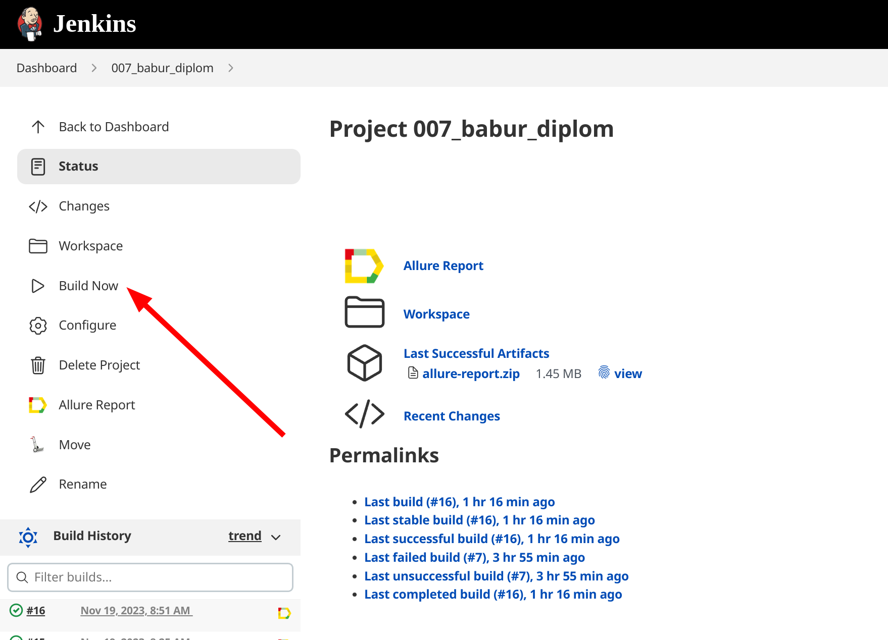
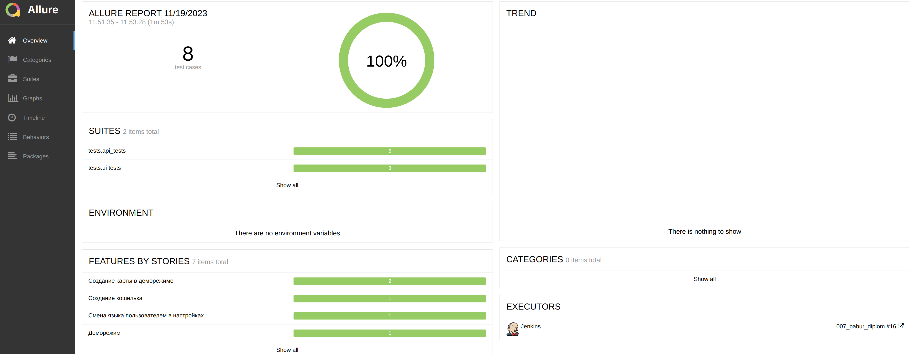
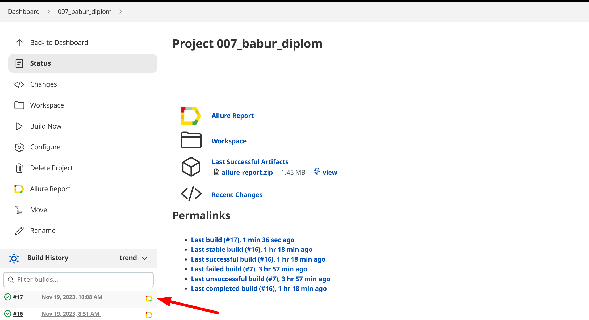
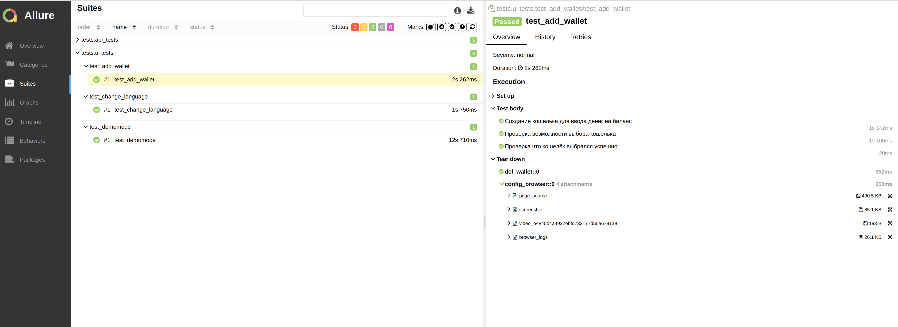
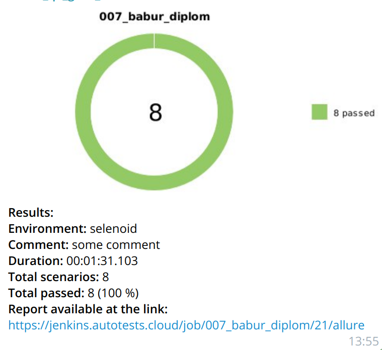

# Пример покрытия автотестами для проекта ComboCards
>Easy to use virtual cards for advertising and business purchases
Issue cards with no limits, manage expenses, and scale marketing campaigns in just a few clicks


###  Используемые технологии
<p align="center">
  <code></code>
  <code></code>
  <code></code>
  <code></code>
  <code></code>
  <code></code>
</p>

## Тестируемый функционал:
1. Логин через UI в фикстуре
2. Проверка доступов пользователя в демонстрационном режиме (
   * Нет возможности выпускать карты
   * В интерфейсе показываются необходимые указатели для верификации
3. Изменение языка интерфейса на русский и на английский
4. Добавление крипто-кошелька для ввода средств на баланс и последующее его удаление


## Запуск тестов
#### Все UI тесты запускаются удалённо (Jenkins), но их можно запустить и локально
<video width="600" height="500" controls>
  <source src="../../images/test_video.mp4" type="video/mp4">
</video>

### Локально
Важно! Перед запуском нужно создать файл .env и указать все параметры которые перечислены в .env-example 

Для запуска тестов локально, нужно выполнить следующие шаги
1. Склонировать репозиторий
2. Открыть проект в PyCharm
3. Ввести в териминале команды
``` 
python -m venv .venv
source .venv/bin/activate
pip install -r requirements.txt
pytest .
```
#### Возможна установка зависимостей с помощью poetry:
```
poetry instal
poetry shell
pytest .
```

### С помощью [Jenkins](https://jenkins.autotests.cloud/job/007_babur_diplom)
#### Для запуска автотестов необходимо:
 - Открыть [джоб](https://jenkins.autotests.cloud/job/job/007_babur_diplom) в jenkins
 - Нажать на Build



## Отчет о прохождении тестов (Allure)
### Локально
Для получения отчета нужно ввести команду 
```
allure serve allure-results
``` 
Ниже представлен пример allure отчета 


Подробные инструкции по работе с allure можно найти по [ссылке](https://allurereport.org/docs/).
### Если тесты запускались в Jenkins

Для получения отчета нужно нажать на иконку allure report'a в строке билда  

### Общая информация по тестовому прогону


### Для каждого теста прикладываются логи браузера, скириншоты и видео выполнения теста


### В проекте настроена отправка краткого отчета в Telegram


